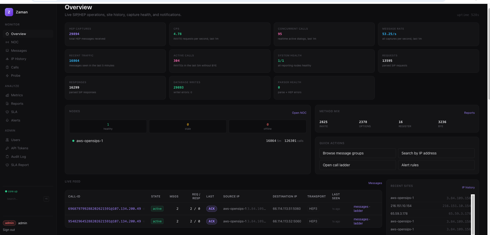
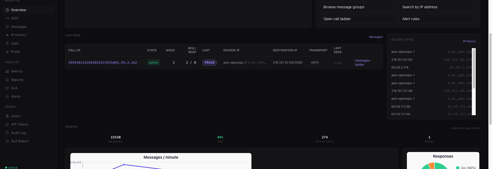

# Makori

Makori is a compiled language for backend and systems work. You write `.mko`
files; Makori turns them into standalone native binaries — no garbage collector,
no VM, nothing extra to install next to them at runtime.

> **Renamed from Mako.** The original name conflicted with
> [Python's Mako templating engine](https://www.makotemplates.org/), which has
> been around since 2006. To avoid confusion between the two projects, the
> language is now called **Makori**. The `mako` command still works as a
> backward-compatible alias, and the `.mko` file extension is unchanged —
> existing code requires zero modifications.

**Status: alpha (v0.6.34).** It works, it compiles real programs, people have
built things with it. It is not stable. APIs will change, features are missing,
and there are bugs. If that's fine with you, read on.

[mako-lang.com](https://mako-lang.com) · [Changelog](CHANGELOG.md) · [Roadmap](docs/ROADMAP.md) · [Status](docs/STATUS.md)

---

## Install

**Linux**

```bash
curl -fsSL https://github.com/loreste/mako/releases/latest/download/install-linux.sh | bash
source "$HOME/.local/share/mako/env.sh"
makori version
```

**macOS**

```bash
curl -fsSL https://github.com/loreste/mako/releases/latest/download/install-release.sh | bash
source "$HOME/.local/share/mako/env.sh"
```

**Windows** — grab the `.zip` from [Releases](https://github.com/loreste/mako/releases),
or build from source with LLVM clang on PATH.

**From source** (needs Rust):

```bash
make install
makori version
```

You do not need Rust on the machine that runs Makori. The installer downloads a
prebuilt binary bundle.

**macOS** release binaries ship with a bundled linker (LLD) — no Xcode, clang,
or any external C toolchain is required. Install and build native binaries
out of the box. **Linux** currently requires `gcc` or `clang` for linking.

---

## What it looks like

```mko
fn main() {
    let ch = make(chan[string], 4)
    crew t {
        let p = t.kick(produce(ch))
        for msg in range ch {
            print(msg)
        }
        let _ = p.join()
    }
}

fn produce(ch: chan[string]) -> int {
    let _ = ch.send("hello")
    let _ = ch.send("world")
    ch.close()
    return 0
}
```

```bash
makori init hello && cd hello
makori run main.mko
makori build --release main.mko -o hello
```

## What actually works

**Language.** Static types with local inference. `Result[T, E]` and `Option[T]`
with `?` propagation. Pattern matching with exhaustive checking and match guards.
Concise `if let` single-arm matching (`if let Some(v) = opt { ... } else { ... }`).
Enums with payloads. Generics (monomorphized). Interfaces (structural, like Go).
Closures with mutable captures. Tuples and multi-return. Integer literals in
decimal, hex (`0xFF`), binary (`0b1010`), and octal (`0o77`) with `_` separators.
`defer`. Labeled loops. F-strings with stack builders. Struct update syntax.
Iterator combinators (`xs.map(fn)`, `xs.filter(fn)`, `xs.reduce(init, fn)` on slices)
with zero-allocation inline loop codegen. Variadic parameters (`fn f(args: ...T)`).
Compile-time file embedding (`embed("file.txt")` and `embed_bytes("file.bin")`).
Conditional compilation (`#[cfg(os = "...")]` / `#[cfg(arch = "...")]`).
Pipe operator (`|>`). `prove` contracts. `live fn` hot-reload foundation.
Contextual `raw` keyword and `raw []T` non-COW arrays for zero-atomic-overhead
hot paths (while allowing `raw` as an ordinary struct field or variable name).

**Memory.** Ownership tracking with compile-time move checks and position-aware
last-use move optimization. Multi-mention statement move safety: multiple accesses
in a single statement borrow or clone cleanly without premature zeroing.
Unconditional zero-initialization of struct and tuple stack temporaries, preventing
uninitialized padding bytes from leaking. Arenas for bulk allocation (`arena`
freed on scope exit). Bounds checks in debug and release. Escape analysis.
Deterministic cleanup with copy-on-write slices — no GC. The C backend shares
owned heap backing through atomic reference counts and detaches before
mutation; borrowed views and pool-backed buffers never enter that release
path. The native backend tracks owned and borrowed values explicitly across
calls and returns. **Raw arrays** (`raw []T`) opt out of COW entirely — plain
`malloc` backing, no refcount header, no atomic ops, single-owner move
semantics with unconditional `free` at scope exit. The ownership and runtime
safety model was introduced in 0.2.4 and continues to be hardened through
adversarial tests, sanitizers, leak checks, and regression gates. It is not
formally proven complete. `unsafe` and FFI are outside the model.

**Concurrency & Parallelism.** Structured concurrency with `crew` / `kick` / `join`
where ordinary crew jobs cannot outlive their scope (no orphan tasks).
Structured nursery cancellation policies: `crew:all` (wait all), `crew:race` / `crew:any`
(first to finish cancels remaining siblings), `crew:fail_fast` (child error cancels
siblings immediately), and `crew(fail_fast=true)`. Zero-allocation small channels
via inline 4-slot ring buffers (`inline_buf[4]`) in `MakoChan`. Guaranteed blocking
client sockets on accept (`tcp_accept`, `tcp_accept_nb`, and `unix_accept` clear
inherited nonblocking flags from nonblocking listeners so worker threads do not
spin or hang on `EAGAIN`/`EWOULDBLOCK`). Typed channels (`chan[int]`, `chan[string]`,
`chan[T]`), `select` with timeouts and defaults, `fan` for parallel map.
Actors with mailboxes. No free `go` keyword — every spawned task has an owner.

**Stdlib.** HTTP/1.1 and HTTP/2 servers and clients with ALPN and chunked streaming.
TLS (OpenSSL) with multi-certificate SNI. WebSocket. JSON encoding and decoding
with streaming builders. SQLite and Postgres connection pools with transactions.
SIP parsing and building. HEP (Homer) ingest. UDP/TCP/Unix domain sockets.
Direct I/O (`mako_dio`) and memory-mapped files (`MMap`). File I/O. Regex (with RE2
backrefs and Unicode `\p{L/N}`). UUID and ULID. Base64. Binary buffers (`Buf`).
Prometheus metrics. Crypto (SHA-256, HMAC, PBKDF2, AEAD, DTLS 1.2 / SRTP, P-256).
Protobuf wire codec. gRPC unary frames and service registry. Application packs have
Go-equivalent surfaces (`strings`, `bytes`, `io`, `os/env`, `net/netip`, `math/bits`,
`hash/crc32`, `crypto/rand`, `image`, … — Makori names, not a syntax clone).
Coverage is detailed in [STDLIB.md](docs/STDLIB.md).

**Backends.** Native object code default (Cranelift). C backend
remains available via explicit `--backend c` as the oracle for sanitizers,
cross-compilation, and emit-c; unsupported native/LLVM modes hard-error instead
of silently falling back. Both backends produce standalone binaries. LLVM
release builds available with `--backend llvm --release`.
On macOS, the native backend ships with a bundled linker (LLD) — no clang or
Xcode required. On Linux, `gcc` or `clang` is needed for linking.

**Packages.** `makori pkg` manages dependencies with a lockfile, SHA-256 content
hashes, and SemVer resolution. Supports path deps, git deps, local registry,
and remote HTTPS registry. The default public registry is
`https://loreste.github.io/mako-packages` — `makori pkg get <name>` fetches
from it automatically. Packages can be signed with ed25519 and verified
on fetch.

**Tooling & Observability.** `makori fmt`, `makori lint` (including `--identity`),
`makori test` (with JSON reports and `--coverage`), `makori check` (with `--json=v1`
for IDE diagnostics), `makori doc` (API docs and search index), `makori profile`.
Deep developer tracing: hierarchical call trees (`MAKO_TRACE=tree`), Chrome Trace /
Perfetto timeline export (`MAKO_TRACE_JSON=<path>`), and channel operation telemetry
(`MAKO_TRACE_CHAN=1`), strictly zero-cost under release `-DNDEBUG`.
Interactive debugger integration with `makori debug` (LLDB with custom Mako formatters)
and `makori dap` (VS Code DAP protocol adapter). LSP server with completions,
go-to-def, references, rename, diagnostics, and inlay hints. VS Code extension.

## Built with Makori

**Zaman** — live SIP/HEP operations with capture health, active-call state,
message inspection, site history, reports, alerts, and traffic metrics.





## What does not work yet

- Linux native backend requires `gcc` or `clang` for linking (installer handles this)
- WASM: WASI Preview 1 only — no sockets, no TLS, no Preview 2/WIT/DOM
- Sanitizers, cross-compilation, and emit-c require explicit `--backend c`
- Full IDE visual breakpoint debugging is still maturing (`makori debug` and `makori dap` provide command-line and DAP foundations)
- Stdlib coverage is uneven — some APIs are shape-only
- No stable ABI promise
- Package registry is public but has few packages; signing lacks key rotation and revocation
- Windows: ~21 test fixtures fail (filesystem semantics, signals, crypto paths); HTTP engine incomplete
- Package security model is not independently audited

[STATUS.md](docs/STATUS.md) has the full honest list.

## New in 0.6.34

- **Actor typed payloads:** `receive` arms now accept `string`, multi-param, and struct payloads (not just `int`). Single `int` keeps zero-allocation packing; multi-param/non-int generates envelope structs. Closes #60.
- **Iterator invalidation prevention:** Compile-time error when mutating, reassigning, or appending to a slice while iterating over it in a `for` loop body, eliminating use-after-free and reallocation crashes.
- **Channel trylock fast path & race elimination:** Switched channel spinlocks to platform-native mutex trylocks (`pthread_mutex_trylock` / SRWLock), fully eliminating TSan races while keeping 1.21x vs Rust uncontended channel throughput.
- **Stack size safety & configurability:** Restored 8MB default thread stack to prevent stack overflows on deeply nested calls (e.g. FayDB SQL engine); added `sched_set_stack_size()` API for custom workloads.
- **Single-owner raw array use-after-move tracking:** Static compile-time tracking rejects accessing `raw []T` bindings after transfer into function calls.
- **Dead code elimination & struct retention:** Multi-package builds now accurately retain struct definitions referenced through function return types across package boundaries (issue #59).
- **Nonblocking socket accept race fix:** Linux listener cleanly blocks on client accept, preventing race conditions under high concurrency (issue #58).

## New in 0.6.33

- **`if let`:** Concise single-arm pattern matching — `if let Some(v) = expr { ... } else { ... }`. Works with Option and Result.
- **Iterator combinators:** `xs.map(fn)`, `xs.filter(fn)`, `xs.reduce(init, fn)` as methods on `[]T`. Inline loop codegen.
- **Variadic functions:** `fn log(msgs: ...string)` — `...T` in parameter position desugars to `[]T`.
- **Compile-time embed:** `embed("file.txt")` reads a file as a string literal at compile time. `embed_bytes("file.bin")` for `[]byte`.
- **Conditional compilation:** `#[cfg(os = "darwin")]` / `#[cfg(arch = "aarch64")]` on functions.
- **Contextual `raw` keyword & raw arrays (`raw []T`):** Non-COW single-owner arrays with plain `malloc` backing (zero atomic overhead). `raw` is parsed contextually for types; struct fields and variables may freely use `raw` without collisions.
- **C backend struct move safety & padding:** Fixes premature move zeroing on multi-mention statements and ensures unconditional `memset` of stack struct/tuple padding bytes.
- **Nonblocking socket accept fix:** Explicitly clears `O_NONBLOCK` on accepted client fds across all platforms so worker threads do not hit `EAGAIN` / `EWOULDBLOCK`.

## New in 0.6.32

- **Structured crew cancellation policies:** `crew:all`, `crew:race`, `crew:any`, `crew:fail_fast`, and `crew(fail_fast=true)`. Eliminates orphan tasks by construction.
- **Deep developer tracing:** `MAKO_TRACE=tree` (call tree), `MAKO_TRACE_JSON=<path>` (Chrome/Perfetto), `MAKO_TRACE_CHAN=1` (concurrency events).
- **Zero-allocation small channels:** Inline 4-slot ring buffer eliminates heap allocations for unbuffered and small channels.
- **Struct literal `memset` elision:** Skips redundant zeroing when all struct fields are provided.

See [CHANGELOG.md](CHANGELOG.md) for earlier releases.

## Concurrency

Makori has no free `go`. Every task belongs to a `crew`:

```mko
crew t {
    let a = t.kick(work(1))
    let b = t.kick(work(2))
    print(a.join())
    print(b.join())
}
// both tasks joined here, guaranteed
```

Channels are typed and work across kicked tasks:

```mko
let ch = make(chan[string], 8)
// send from one task, range-recv in another
for msg in range ch {
    print(msg)
}
```

## WebAssembly

Makori compiles to WASM via the C backend and zig (or wasi-sdk):

```bash
makori build main.mko --target wasm32-wasip1 -o main.wasm
wasmtime main.wasm
```

WASI Preview 1 is supported — args, env, filesystem (via preopens), stdout.
Networking, TLS, and stdlib areas that depend on POSIX sockets or OpenSSL are
not available in WASM. The output is a standalone `.wasm` module runnable by
wasmtime, wasmer, or any WASI-compatible runtime. Concurrency primitives
(`crew`/`kick`) run sequentially under WASM — correct behavior, single-threaded.

```bash
# With filesystem access
wasmtime --dir=./data::. main.wasm

# With env vars and args
wasmtime --env KEY=value main.wasm arg1 arg2

# Browser/edge scaffold
makori deploy wasm dist --entry main.mko --wasm app.wasm --port 8080
```

**Limitations:** WASI Preview 1 only. No Preview 2 component model, no WIT,
no browser DOM bindings, no WASM sockets. Cross-compilation requires zig on
PATH or `WASI_SDK_PATH` set.

## Errors

If a function returns `Result`, you have to handle it:

```mko
fn load(path: string) -> Result[string, string] {
    let data = read_file(path)?
    Ok(data)
}
```

## Testing

```bash
makori test examples/testing               # run all tests
makori test -r TestAdd -v                   # filter + verbose
makori test --sanitize address examples/testing  # under ASan
```

452 `*_test.mko` files under `examples/testing` (inventory 2026-09-11).
The suite is exercised under ASan and UBSan in CI.
A focused concurrency subset is exercised under TSan.

## Docs

| | |
|---|---|
| [The Makori Book](docs/book/) | Start here |
| [Language Guide](docs/GUIDE.md) | Syntax reference |
| [Standard Library](docs/STDLIB.md) | What's included |
| [CLI Reference](docs/CLI.md) | Commands and flags |
| [Examples](docs/EXAMPLES.md) | Runnable programs |
| [Performance](docs/PERFORMANCE.md) | Benchmarks (including where Makori is slower) |
| [Soundness](docs/SOUNDNESS.md) | Memory safety program |
| [Security](docs/SECURITY.md) | Safety model |
| [Status](docs/STATUS.md) | What works, what doesn't |

## Editor support

VS Code extension with syntax highlighting, LSP, format-on-save, and a dark
theme. The language server (`makori lsp`) speaks stdio JSON-RPC.
See [editors/vscode/](editors/vscode/).

## Contributing

See [CONTRIBUTING.md](CONTRIBUTING.md).

## License

MIT
